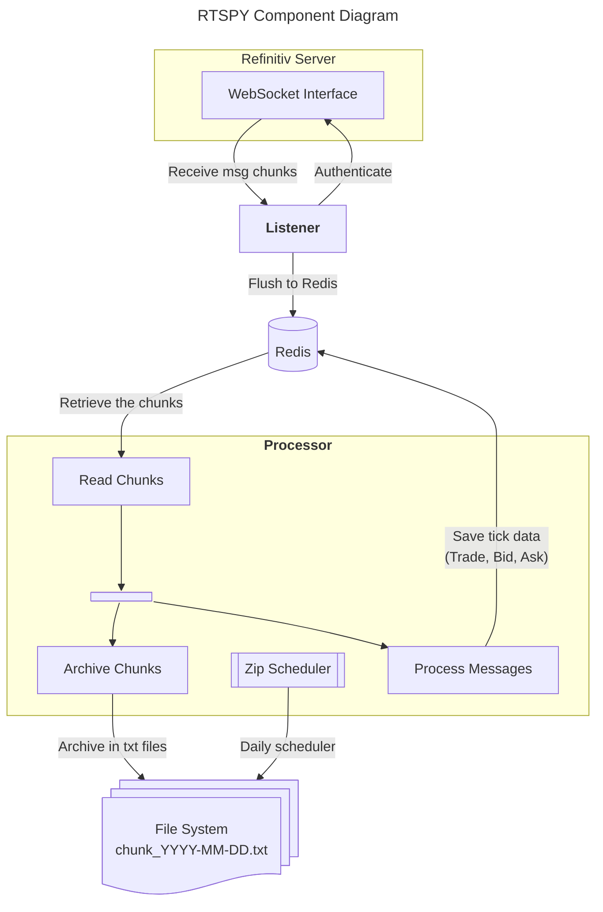
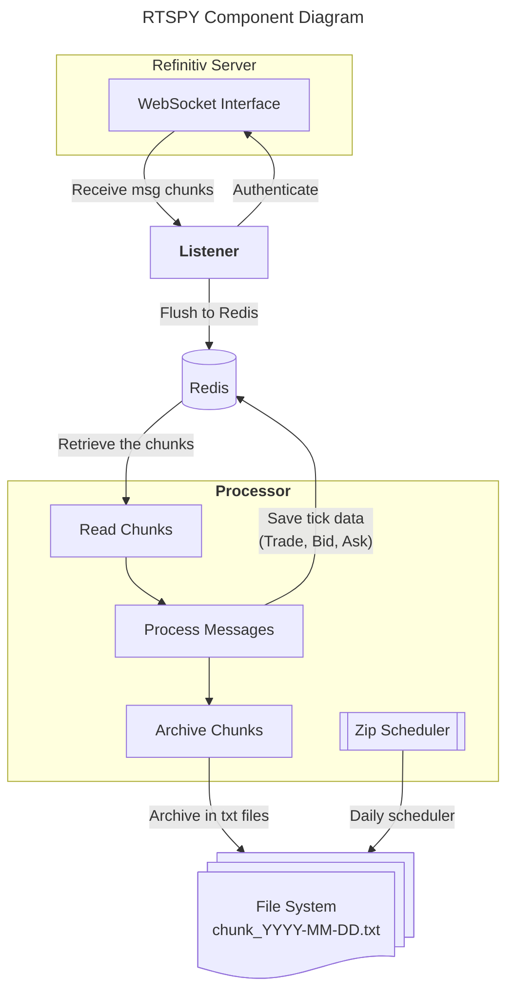

# Fastai2-Medium
Repository with the code (notebooks) and data (training patches) for the medium stories covering Fastai 2.

Notebook `01_Create_Datablock.ipynb` has the code for <b>How to create a DataBlock for Multispectral Satellite Image Segmentation with the Fastai-v2 library (part 1)</b> story (https://medium.com/@cordmaur/how-to-create-a-datablock-for-multispectral-satellite-image-segmentation-with-the-fastai-v2-bc5e82f4eb5).

